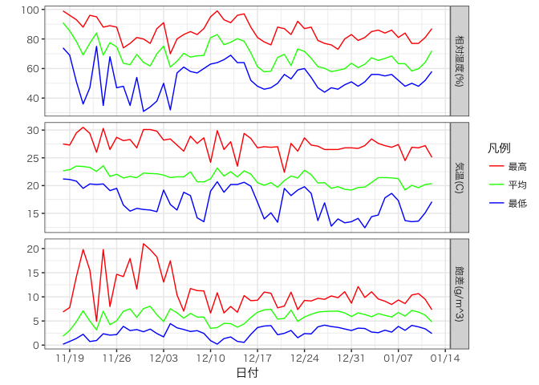
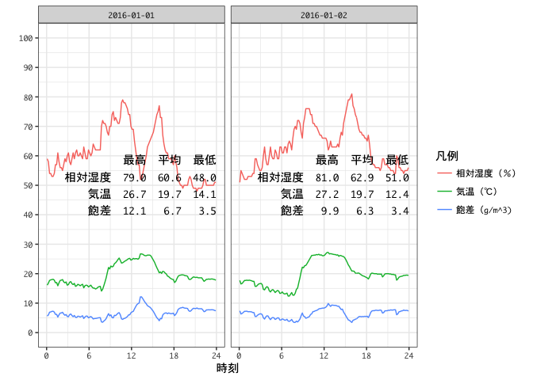

<!-- README.md is generated from README.Rmd. Please edit that file -->
RondTool
========

目的
----

安価な温湿度データロガーである「おんどとり（T&D)」から得られる温度、湿度データに基づき、湿度諸量の計算や可視化を行うためのツールを提供します。

主に温湿度のプロットを目的としているため、温度・相対湿度の2chの測定データが必要であると考えてください。そのようなデータを採取できるモデルとしては、例えば「TR-72wf」があります。

使用方法
--------

### データの読み込み

データを読み込む際は、基本的にはread\_ocsv\_rh()を使用します。読み込むことによって、POSIXctクラスで測定時刻を表すdatetime列、Dateクラスで測定日のみを表すday列（これは日別に最大値や最小値、平均値などを算出する場合に便利です）が追加される他、2種類の飽差が自動的に計算され、列として追加されます。

#### 2種類の飽差について

現在農業分野では「飽差」という単語が2通りの意味に使用されており、若干の混乱があります。

飽差(VPD)は、測定時の気温における飽和水蒸気圧と、その空気が持つ水蒸気圧の差として定義されます。したがって、単位はhPaになります。従来、施設園芸を対象とした学問分野ではこの飽差が広く利用されてきました。圧力を基準としているため、蒸発速度などを考察する際には有用です。

もう一つの飽差(HD)は、測定時の気温における飽和水蒸気量と、その空気が実際に持っている水蒸気の量である絶対湿度（なお、「絶対湿度」という用語も分野により定義が若干異なります）の差として定義されます。従って、単位は (g/m^3) です。この値は水蒸気量を基準としているため、加湿に必要な水量などを考察する場合には有用です。それに加えて、施設園芸の先進国であるオランダの教科書でこの飽差が使用されているという経緯から、近年の一般向け農業雑誌などではほとんどの場合こちらの飽差が使用されています。植物の成育にとっては 3〜6g/m^3 の飽差が良いという説が広まっており、概ね上手くいくようです。ただ、気流の影響を考慮せず湿度だけで植物成育への影響を語るのはすこし難しいのではとも思います。

余談が過ぎましたが、いずれの飽差も「空気の乾きやすさ」を表すという点では同じような意味がありますが、飽差(VPD)は飽差(HD)よりも大きな値となるため、どちらの飽差が使用されているのかには注意しておく必要があります。

### 湿度諸量の計算

read\_oscv()でデータを読み込んだ場合、飽差は自動的に計算されますが、温湿度を引数としてこれらを計算する関数も用意してあります。?svp、?vpd、?w.difなどを参照してください。

### データのプロット

データはondo.summarized.plot()またはondo.raw.plot()によりプロットすることができます。

飽差は(現状では)飽差(HD)が出力されます。

ondo.summarized.plot()は相対湿度、気温、飽差について、日ごとに最高・最低・平均値を算出し、それぞれを繋げた折れ線グラフを出力します。

``` r
library(RondTool)
tmp = read_ocsv_rh("testdata/160112_1_temp_rh.csv")
ondo.summarized.plot(tmp)
```



ondo.raw.plot()は、相対湿度、気温、飽差について、記録されたデータをそのままプロットします。この時、グラフは日別に区切られ、それぞれのグラフの中央に相対湿度、気温、飽差の日ごとの最高・最低・平均値がテキストとして記入されます。

``` r
ondo.raw.plot(tmp, start="2016/01/01", end="2016/01/02")
```



インストール
------------

``` r
devtools::install_github("nozma/RondTool")
library(RondTool)
```
